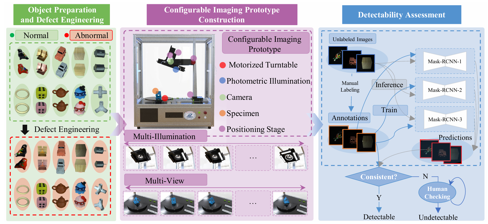
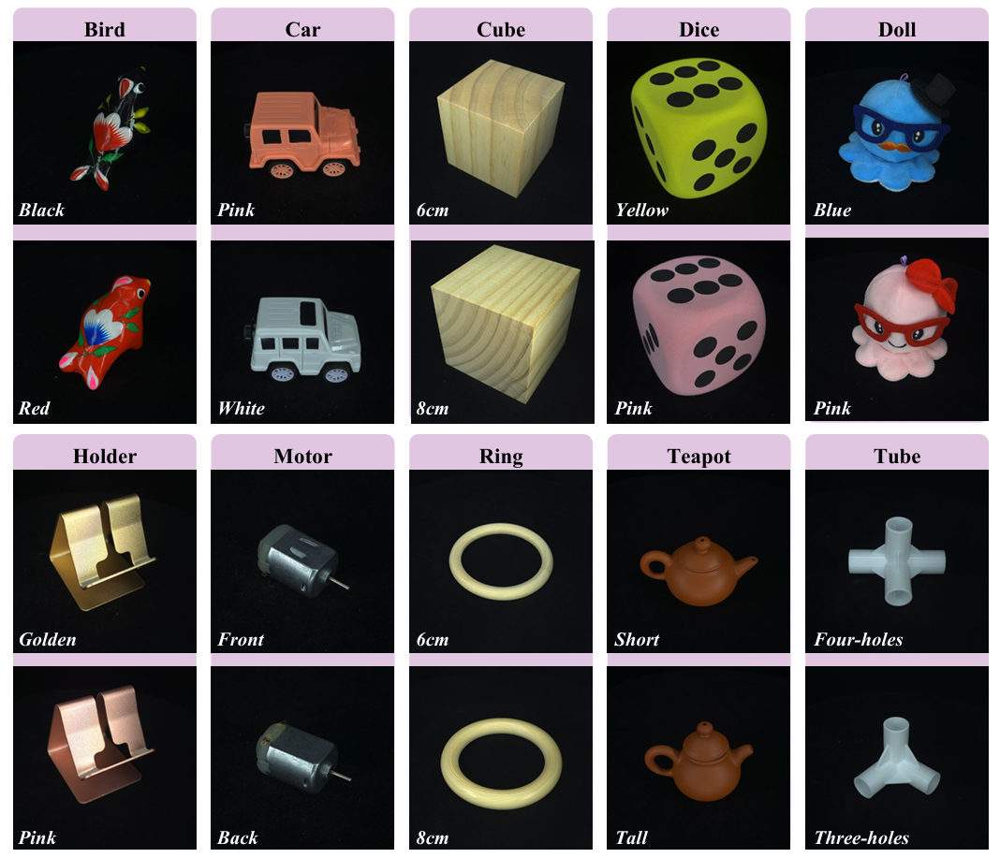
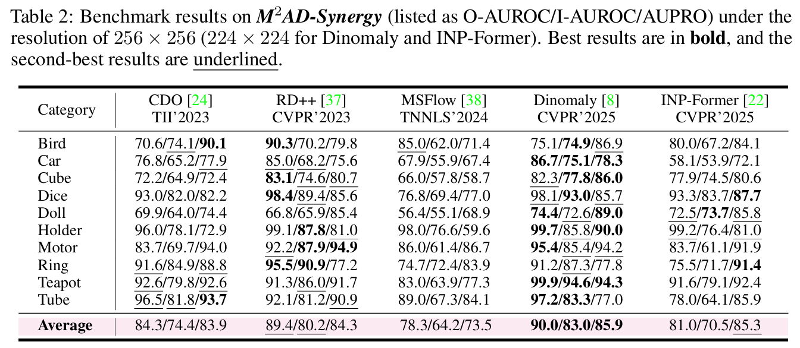
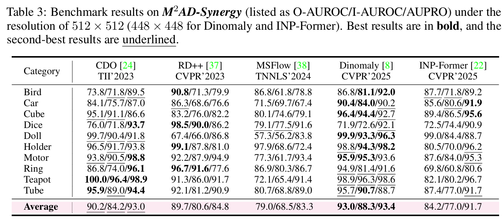

# Visual Anomaly Detection under Complex View-Illumination Interplay: A Large-Scale Benchmark  
🌐 [Hugging Face Dataset](https://huggingface.co/datasets/ChengYuQi99/M2AD)  


> 📚 [**Paper**](https://arxiv.org/abs/2505.10996) • 🏠 [**Homepage**](https://hustcyq.github.io/M2AD/)  
> by [Yunkang Cao*](https://caoyunkang.github.io/), [Yuqi Cheng*](https://hustcyq.github.io/), [Xiaohao Xu](), [Yiheng Zhang](), [Yihan Sun](), [Yuxiang Tan](), [Yuxin Zhang](), [Weiming Shen](https://scholar.google.com/citations?user=FuSHsx4AAAAJ&hl=en),  


## 🚀 Updates  
We're committed to open science! Here's our progress:  
* **2025/05/19**: 📄 Paper released on [ArXiv](https://arxiv.org/abs/2505.10996).  
* **2025/05/16**: 🌐 Dataset homepage launched.  
* **2025/05/24**: 🧪 Code release for benchmark evaluation!  


## 📊 Introduction  
Visual Anomaly Detection (VAD) systems often fail in the real world due to sensitivity to **viewpoint-illumination interplay**—complex interactions that distort defect visibility. Existing benchmarks overlook this challenge.  

Introducing **M2AD** (Multi-View Multi-Illumination Anomaly Detection), a large-scale benchmark designed to rigorously test VAD robustness under these conditions:  
- **119,880 high-resolution images** across 10 categories, 999 specimens, 12 views, and 10 illuminations (120 configurations).  
- **Two evaluation protocols**:  
  - 🔄 **M2AD-Synergy**: Tests multi-configuration information fusion.  
  - 🧪 **M2AD-Invariant**: Measures single-image robustness to view-illumination variations.  
- Key finding: SOTA VAD methods struggle significantly on M2AD, highlighting the critical need for robust solutions.  


## 🔍 Overview of M2AD  
### 📷 Data Collection Process  
  

### 10 Anomaly Categories  
  

### Multi-Illumination & Multi-View Setup  
  


## 🛠️ Getting Started  
### 📦 Environment Setup  
Clone and install dependencies:  
```bash  
git clone https://github.com/hustCYQ/M2AD.git && cd M2AD  
conda create --name M2AD_env python=3.9 -y  
conda activate M2AD_env  

# Core dependencies  
pip install timm==0.8.15dev0 opencv-python==4.9.0.80 numpy==1.26  
pip install thop seaborn mmselfsup pandas transformers imgaug tensorboard  

# Optional extras  
pip install git+https://gitcode.com/gh_mirrors/cl/CLIP  
conda install -c conda-forge accimage  
pip install mmdet==2.25.3 adeval torch==2.1.2 --index-url https://download.pytorch.org/whl/cu118  
```  

### 📂 Dataset Preparation  
Our dataset is hosted on [Hugging Face](https://huggingface.co/datasets/ChengYuQi99/M2AD). You can also download via:  

| Dataset       | Google Drive       | Baidu Drive (🔑: flg9/pwus)       | Resolution  
|---------------|--------------------|-----------------------------------|------------|  
| M2AD-1024     | [Download]         | [Baidu]() | 1024x1024  |  
| M2AD-256      | [Download]         | [Baidu]() | 256x256    |  

**Data Structure**:  
```  
M2AD_1024/  
├── Bird/  
│   ├── Good/       # Normal samples  
│   ├── GT/         # Ground-truth anomaly masks  
│   └── NG/         # Anomalous samples  
├── Car/  
... (10 categories total)  
```  
Update `DATA_ROOT` and `DATA_SUBDIR` in `/data/dataset_info` to match your path.  


### 🚀 Train & Evaluate  
We provide ready-to-use scripts for 5 SOTA methods:  
```bash  
# Example: Train CDO on M2AD-Synergy  
CUDA_VISIBLE_DEVICES=0 python run_dataset.py --cfg_path configs/benchmark/cdo/cdo_100e.py -m train -s M2AD-Synergy  

# Evaluate on M2AD-Invariant  
CUDA_VISIBLE_DEVICES=0 python run_dataset.py --cfg_path configs/benchmark/msflow/msflow_100e.py -m test -s M2AD-Invariant  
```  
**Key Arguments**:  
- `-s M2AD-Synergy`: Evaluate multi-view/illumination fusion.  
- `-s M2AD-Invariant`: Test single-image robustness.  


## 🧩 Trainer Framework  
Our modular trainer (extended from [ADer](https://github.com/zhangzjn/ADer)) simplifies VAD development:  
- Core components: `forward()`, `compute_loss()`, `compute_anomaly_scores()`.  
- Example implementation: `trainer/cdo_trainer.py` and `model/cdo.py`.  
- Build new methods with minimal code changes!  

## 📊 Main Results  
### 1. Performance on M2AD (256x256)  
  

### 2. Performance on M2AD (512x512)  
  


## 🙏 Acknowledgements  
Grateful to these projects for inspiration:  
- 🌟 [ADer](https://github.com/zhangzjn/ADer) – Anomaly detection framework.  
- 🎨 [EyeCandies](https://eyecan-ai.github.io/eyecandies/) – Project page.  


## 📖 Citation  
If M2AD aids your research, please cite:  
```bibtex  
@article{M2AD,  
  title={Visual Anomaly Detection under Complex View-Illumination Interplay: A Large-Scale Benchmark},  
  author={Cao, Yunkang and Cheng, Yuqi and Xu, Xiaohao and Zhang, Yiheng and Sun, Yihan and Tan, Yuxiang and Zhang, Yuxin and Huang, Xiaonan and Shen, Weiming},  
  journal={arXiv preprint arXiv:2505.10996},  
  year={2025}  
}  
```  

## Contact
If you have any questions about our work, please do not hesitate to contact [yuqicheng@hust.edu.cn](mailto:yuqicheng@hust.edu.cn).